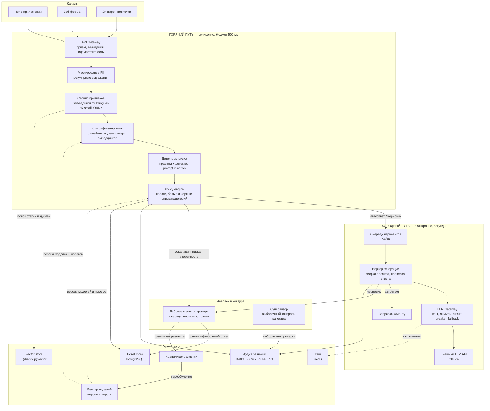
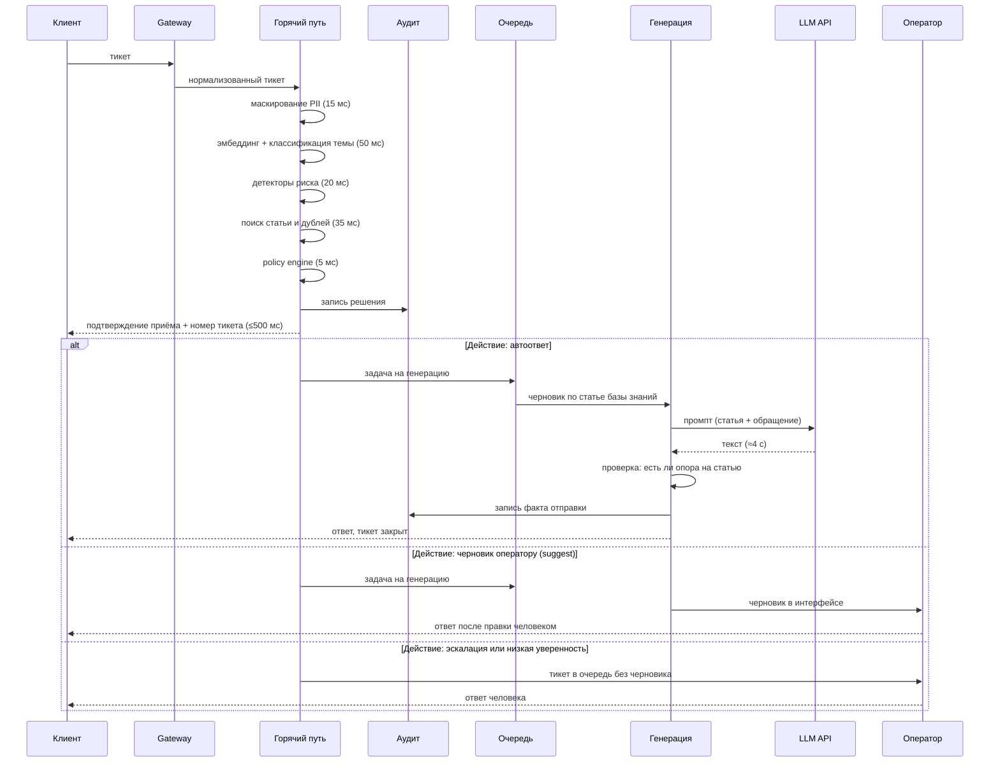

# Целевая архитектура

Аббревиатуры при первом употреблении расшифрованы. Полный глоссарий — в конце README.md.

---

## 1. Главное архитектурное решение

Система разделена на **горячий путь** (синхронный, бюджет 500 мс) и **холодный путь**
(асинхронный, секунды). Разделение проходит ровно по одной линии: **всё, что зависит
от внешнего LLM API (Large Language Model — большая языковая модель), находится
в холодном пути.**

Почему именно так — измеренный факт, а не предположение. Один реальный вызов
Claude API в этом PoC занял **4 240 мс** (замер во время разработки, модель
`claude-opus-5`, короткий промпт). Это в 8,5 раз больше всего бюджета горячего
пути. Любая архитектура, где генерация ответа синхронна, нарушает SLA
(Service Level Agreement — соглашение об уровне сервиса) при первом же обращении.

Следствие: **отказ внешнего LLM API физически не может нарушить SLA
маршрутизации.** Клиент всегда получает подтверждение приёма и попадает
в правильную очередь; деградирует только качество и скорость содержательного
ответа.

---

## 2. Компоненты

**Что делает каждый компонент**

| Компонент | Ответственность | Почему отдельный сервис |
|---|---|---|
| API Gateway | Приём из всех каналов, единый формат тикета, идемпотентность по ключу канал+id | Каналы добавляются независимо от логики |
| Маскирование PII | Замена телефонов, почты, номеров карт на плейсхолдеры **до** любых других шагов | Персональные данные не должны попасть ни во внешний API, ни в логи |
| Сервис признаков | Эмбеддинги текста, ONNX-модель на CPU | Общий для классификатора и поиска — считаем эмбеддинг один раз |
| Классификатор темы | 8 категорий + уверенность | Отдельно версионируется и переобучается |
| Детекторы риска | Prompt injection, юридические угрозы, безопасность, VIP, повтор | Правила меняются оперативно, без переобучения модели |
| Policy engine | Единственное место, где принимается решение о действии | Одна точка правды → одна точка аудита |
| LLM Gateway | Кэш, лимиты, ретраи, circuit breaker, переключение провайдера | Изолирует всю систему от одного внешнего вендора |
| Воркер генерации | Сборка промпта, вызов через Gateway, проверка ответа на соответствие статье | Место, где происходит контроль качества генерации |

---

## 3. Поток данных: от входящего тикета до ответа

---

## 4. Бюджет горячего пути (p95, целевая система)

p95 (95-й процентиль) — значение, ниже которого укладываются 95% запросов.

| Этап | p95, мс | Комментарий |
|---|---:|---|
| Приём и валидация | 10 | HTTP, разбор JSON, идемпотентность |
| Маскирование PII | 15 | Регулярные выражения по тексту до 4 КБ |
| Токенизация и подготовка признаков | 20 | |
| Эмбеддинг multilingual-e5-small (ONNX, CPU) | 45 | 128 токенов, батч размера 1 |
| Классификатор темы (линейная модель) | 5 | Матричное умножение 384×8 |
| Детекторы риска | 20 | Правила + детектор injection |
| Поиск дублей и статьи (ANN, топ-5) | 35 | ANN — Approximate Nearest Neighbours, приближённый поиск ближайших соседей |
| Policy engine | 5 | Ветвление по порогам |
| Запись в аудит (в буфер) | 10 | Fire-and-forget в Kafka, не блокирует ответ |
| Сеть и сериализация | 60 | Внутренние вызовы между сервисами |
| **Итого** | **225** | |
| **Резерв до SLO 500 мс** | **275** | Запас на всплески нагрузки и деградацию узлов |

Резерв в 55% сознательный: под пиковой нагрузкой (распродажа, инцидент
у службы доставки) латентность инференса растёт нелинейно, и бюджет,
свёрстанный «впритык», превращается в нарушение SLA ровно в тот момент,
когда система нужнее всего.

**Измерения в PoC:** горячий путь без эмбеддинг-модели даёт p50 = 0,12 мс,
p95 = 0,15 мс на 200 прогонах. Это подтверждает только то, что правила
и policy engine стоят пренебрежимо мало; основной бюджет в целевой системе
съедают эмбеддинги и сеть, которых в PoC нет.

---

## 5. Синхронные и асинхронные части

| Свойство | Горячий путь | Холодный путь |
|---|---|---|
| Что делает | Классификация, риск, маршрутизация | Генерация ответа, отправка |
| Бюджет | 500 мс на тикет | до 60 с, целевое p95 ≈ 8 с |
| Зависит от внешнего LLM | Нет | Да |
| Что при отказе зависимости | Не может отказать по вине LLM | Деградация на шаблон, тикет к оператору |
| Масштабирование | Горизонтально, stateless | Горизонтально, по глубине очереди |
| Гарантия доставки | Ответ синхронно | At-least-once, идемпотентность по ticket_id |

---

## 6. Хранилища

| Хранилище | Технология | Что лежит | Срок хранения |
|---|---|---|---|
| Ticket store | PostgreSQL | Тикеты, статусы, переписка, назначения | По политике продукта |
| Vector store | Qdrant или pgvector | Эмбеддинги статей базы знаний и исторических тикетов, отдельные пространства имён | Пересобирается при обновлении |
| Аудит решений | Kafka → ClickHouse (аналитика) + S3 с Object Lock (неизменяемая копия) | Каждое автоматическое решение | 3 года |
| Кэш | Redis | Эмбеддинги частых запросов, кэш ответов LLM по хэшу (id статьи + нормализованный вопрос) | 24 часа |
| Хранилище разметки | PostgreSQL | Метки категорий, правки операторов, результаты выборочного контроля | Бессрочно |
| Реестр моделей | MLflow + S3 | Версии моделей, пороги, метрики приёмки | Бессрочно |

Кэш ответов заслуживает отдельного пояснения: около трети тикетов в безопасных
категориях — это перефразировки одного и того же вопроса («где заказ»).
Кэширование по паре (статья базы знаний + нормализованный вопрос) снимает
заметную долю вызовов LLM. В расчёте unit-экономики (docs/product.md) этот
эффект **не учитывался** — это сознательно консервативная оценка.

---

## 7. Внешние вызовы и интеграции

| Интеграция | Направление | Таймаут | Политика отказа |
|---|---|---|---|
| Внешний LLM API (Claude) | Исходящий | 20 с | 3 ретрая с экспоненциальной задержкой → circuit breaker (3 отказа подряд → размыкание на 30 с) → шаблонный ответ + оператор |
| Order Management System (система управления заказами) | Исходящий | 300 мс | Тайм-аут не блокирует горячий путь: ответ формируется без данных заказа, оператор получает пометку |
| Служба доставки | Исходящий, асинхронно | 5 с | Только в холодном пути |
| Уведомления клиенту | Исходящий | 3 с | Ретраи из очереди, at-least-once |

**Circuit breaker** (предохранитель) — реализован в PoC (`poc/llm.py`)
и демонстрируется в сценарии 5. Смысл: при недоступности провайдера нет смысла
тратить по 20 секунд таймаута на каждый запрос — очередь захлебнётся. После
трёх отказов подряд вызовы отсекаются мгновенно на 30 секунд, затем делается
один пробный.

---

## 8. Где участвует человек (human-in-the-loop)

| Точка | Кто | Что делает |
|---|---|---|
| Suggest-режим | Оператор | Получает черновик, правит, отправляет. Правка сохраняется как разметка |
| Эскалация | Оператор профильной очереди | Тикеты с высоким риском, автоответ запрещён |
| Низкая уверенность | Оператор общей очереди разбора | Модель явно отказалась от решения |
| Выборочный контроль | Супервизор | Ежедневная проверка 100 случайных автоответов |
| Разбор инцидента | ML-инженер + саппорт-лид | При срабатывании алертов guardrail-метрик |

**Обратная связь замыкает контур обучения.** Правка оператора — это бесплатная
разметка: пара (исходный черновик, финальный ответ) показывает, чего не хватало.
Отдельно фиксируется случай, когда оператор отправил черновик без правок —
сильный положительный сигнал.

---

## 9. Альтернативы, которые я отверг

| Альтернатива | Почему отверг |
|---|---|
| **Один LLM-агент на всё** (классификация, риск, ответ — одним промптом) | Замеренные 4,2 с на вызов не помещаются в 500 мс. Плюс непредсказуемая стоимость и невозможность объяснить решение аудитору: нет ни порога, ни правила, только текст |
| **Синхронная генерация ответа** | То же самое: нарушает SLA при первом обращении и делает доступность системы равной доступности внешнего вендора |
| **LLM для классификации темы** | Классификация — задача с 8 фиксированными классами и десятками тысяч размеченных примеров. Линейная модель поверх эмбеддингов даёт сопоставимое качество за ~5 мс и 0 рублей за вызов |
| **Детектор prompt injection на LLM** | Защита от атаки не должна зависеть от компонента, который атакуют. Правила детерминированы и проверяемы; LLM-детектор добавлен бы вторым слоем, но не первым |
| **Хранение аудита только в ClickHouse** | Аналитическая база допускает удаление и изменение строк. Для аудита нужна неизменяемая копия — S3 с Object Lock |
